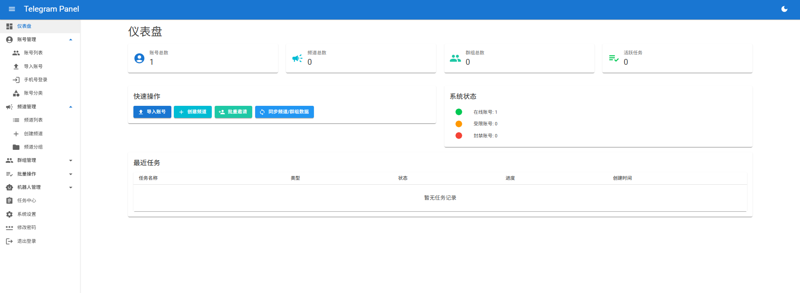
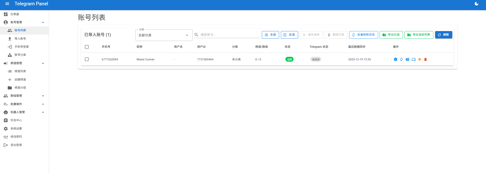
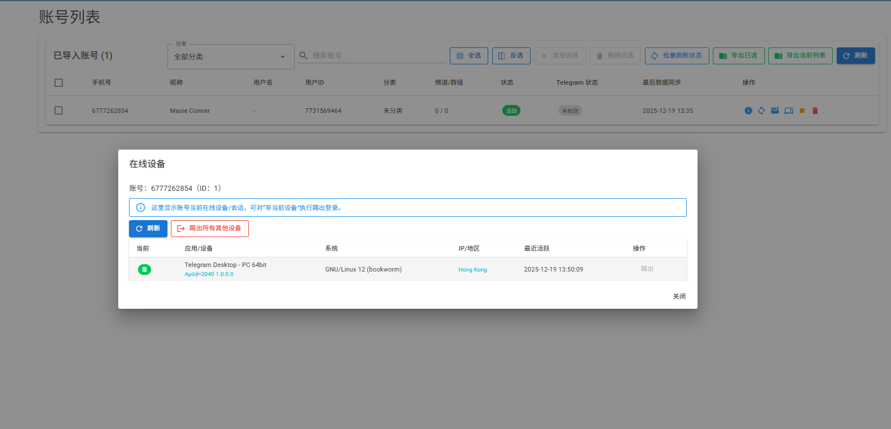

# Telegram Panel - 多账户管理面板

基于 **WTelegramClient** 的 Telegram 多账户管理面板（.NET 8 / Blazor Server），用于批量管理账号、统计与管理频道/群组、执行批量任务。

## 社区

- TG 频道：https://t.me/zhanzhangck
- 站长交流群：https://t.me/vpsbbq

## 功能亮点

- 📥 **多账号批量导入/登录**：支持 Session/压缩包导入；支持手机号验证码登录与 2FA 密码
- 🔁 **账号维度一键切换操作**：选择不同账号创建频道/群组、查看与管理账号创建的数据
- 👥 **批量运营能力**：批量邀请成员/机器人、批量设置管理员、导出链接等高频操作
- 🧾 **同步 + 任务中心**：同步账号“创建的频道/群组”到本地 DB；批量任务后台静默执行，刷新页面不影响

> “同步”到底同步什么：见 `docs/sync.md`

## 截图

> 仓库自带后台截图：`screenshot/`

<details>
<summary>点击展开/收起截图</summary>

| | | |
|---|---|---|
|  |  |  |
|  |  |  |
|  |  |  |
|  |  |  |

</details>

## 🐳 Docker 一键部署（推荐）

面向小白：**`git clone` → `docker compose up` → 浏览器打开 → 登录改密码 → 配置 ApiId/ApiHash**。

### 环境要求

- Docker（Windows 推荐 Docker Desktop + WSL2；Linux 直接装 Docker Engine）

### 启动

```bash
git clone https://github.com/moeacgx/Telegram-Panel
cd Telegram-Panel
docker compose up -d --build
```

启动后访问：`http://localhost:5000`

### 默认后台账号（首次登录）

- 用户名：`admin`
- 密码：`admin123`

登录后到「修改密码」页面改掉即可。

### 必做配置：Telegram API 凭据

到 https://my.telegram.org/apps 获取 `api_id` / `api_hash`，然后在面板「系统设置」里保存。

### 数据持久化（别乱删）

容器内所有持久化数据统一挂载到宿主机 `./docker-data`：

- 数据库：`./docker-data/telegram-panel.db`
- Sessions：`./docker-data/sessions/`
- 系统设置本地覆盖：`./docker-data/appsettings.local.json`
- 后台登录凭据文件：`./docker-data/admin_auth.json`

### 更新升级（git pull + 重新构建）

```bash
git pull
docker compose up -d --build
```

## 🌐 反向代理一条龙（可选）

Blazor Server 需要 WebSocket（`/_blazor`），反代必须支持 `Upgrade`。

Nginx 示例（完整说明见 `docs/reverse-proxy.md`）：

```nginx
location / {
  proxy_pass http://127.0.0.1:5000;
  proxy_http_version 1.1;
  proxy_set_header Upgrade $http_upgrade;
  proxy_set_header Connection "Upgrade";
  proxy_set_header Host $host;
}
```

## 本地开发运行（可选）

```bash
dotnet run --project src/TelegramPanel.Web
```

## 详细文档

- `docs/README.md`（索引）
- `docs/import.md`（压缩包批量导入结构）
- `docs/sync.md`（同步说明 + 自动同步）
- `docs/reverse-proxy.md`（Nginx/Caddy 反代，含 WebSocket）
- `docs/api.md`（接口速查）
- `docs/database.md`（数据库/表结构说明）
- `docs/advanced.md`（配置项/数据目录/后台任务等）
