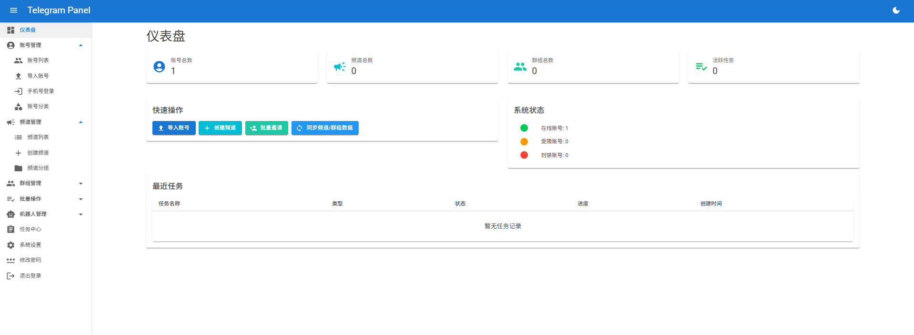
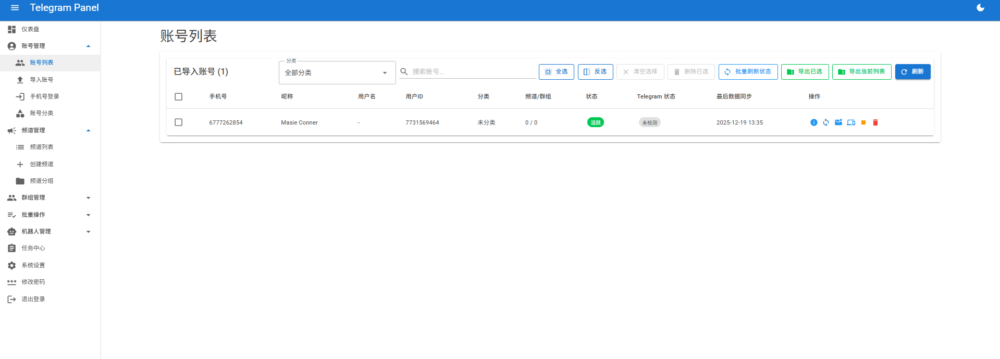

# Telegram Panel

基于 **WTelegramClient** 的 Telegram 多账户管理面板（.NET 8 / Blazor Server）。

<p align="center">
  
  
  
  
</p>

<p align="center">
  📚 <b><a href="https://moeacgx.github.io/Telegram-Panel/">文档站</a></b> |
  🏪 <b><a href="https://faka.boxmoe.eu.org/">API 账号购买</a></b> |
  🖼️ <b><a href="screenshot/">截图</a></b> |
  💬 <b><a href="https://t.me/zhanzhangck">TG 频道</a></b> |
  👥 <b><a href="https://t.me/vpsbbq">站长交流群</a></b>
</p>


## 功能概览

- 📥 多账号批量导入/登录：支持 Telethon/TData 压缩包导入导出；手机号验证码登录；2FA 密码
- 👥 批量运营能力：批量加群/订阅/退群/启动BOT、批量在私密群组自动发送消息养号/批量邀请成员/机器人、批量设置管理员、导出链接等
- 📱 一键踢出其他设备：保留面板当前会话，清理其它在线设备
- 🧹 废号检测与一键清理：封禁/受限/冻结/未登录/Session 失效等状态批量处理
- 🔐 2FA 管理：单个/批量修改二级密码；绑定/换绑找回邮箱（支持对接 Cloud Mail 自动收码确认）
- 👤 账号可见性增强：支持在账号列表一键查看已加入的频道和群组，并展示注册时间（基于 777000 系统通知的估算值，非百分百正确）
- 🧩 模块化扩展：任务 / API / UI 可安装扩展（见 `docs/developer/modules.md`）

## 近期新增功能

- 🧠 AI 验证接入：持续活跃任务支持识别验证消息后自动点击按钮或文本作答
- ⚙️ AI 设置增强：OpenAI 兼容端点、API Key、默认/预设模型、一键连通测试
- 🔁 AI 稳定性：支持配置失败重试次数，AI 决策/作答/连通测试统一复用
- 📚 数据字典能力：支持文本字典/图片字典与模板变量
- 🕒 定时任务能力：新增定时频道/群组相关任务（创建/公开等）
- 🧠 任务中心增强：持续任务支持暂停、编辑、重新运行；任务列表区分执行中与历史任务；支持自动清理
- 💬 持续活跃任务升级：支持多分类账号、随机文案、秒级发送间隔、持续运行配置
- 🔄 同步体验优化：手动“立即同步”改为后台任务执行，可在任务中心跟踪进度
- 👤 账号列表增强：新增注册时间（估算）展示，并可查看账号已加入的频道/群组
- 📺 频道管理升级：频道列表改为“已加入频道”视角，支持多条件筛选与关联账号展示
- 👥 群组管理补齐：新增群组创建、分类、批量操作与列表能力
- 🔗 多账号关系可视化：频道/群组可绑定多个系统账号，列表与详情可查看关联状态
- 🚪 真实退出/解散能力：频道与群组支持单个/批量退出与解散
- 🧹 数据准确性修正：修复频道列表混入群组的问题，优化关系同步后的展示
- ♻️ 同步残留清理：同步完成后自动清理失效关联与孤儿记录
- ⚡ 数据层优化：补充查询与关系索引，提升大量账号/频道/群组场景的筛选性能

## TODO（规划）

- [x] 一键退群/退订、订阅（频道/群组）
- [x] 批量自动签到
- [ ] 一键清空联系人
- [ ] 批量手机号验证码重新登录（用于刷新会话 session）
- [ ] 手机号注册：未注册号支持完整注册流程（姓名/可选邮箱/邮箱验证码等）
- [ ] 通用接码 API：抽象接口 + 主程序只依赖抽象；厂商通过“适配模块”对接（无需改动主程序代码）
- [ ] 支持更换手机号
- [ ] 多代理：支持账号分类绑定代理
- [ ] 多 API：支持账号分类绑定 ApiId/ApiHash
- [ ] 定时创建频道、定时公开频道
- [ ] 定时刷粉丝：对接刷粉 API（通用适配结构），通过适配模块对接多家刷粉平台
- [x] 群聊定时发言养号

## 快速开始

### Docker 一键部署（推荐）

环境要求：Docker（Windows 推荐 Docker Desktop + WSL2；Linux 直接装 Docker Engine）

#### 第一步：准备项目

```bash
git clone https://github.com/moeacgx/Telegram-Panel
cd Telegram-Panel
cp .env.example .env
```

#### 第二步：选择镜像版本

默认是稳定版（无需改动）：

```bash
TP_IMAGE=ghcr.io/moeacgx/telegram-panel:latest
```

如果你要开发版，改 `.env` 为：

```bash
TP_IMAGE=ghcr.io/moeacgx/telegram-panel:dev-latest
```

#### 第三步：启动

```bash
docker compose pull
docker compose up -d
```

访问：`http://localhost:5000`

#### 默认后台账号（首次登录）

用户名：`admin`  
密码：`admin123`

登录后到「修改密码」页面改掉即可。

#### 常用命令

```bash
# 查看日志
docker compose logs -f

# 更新到当前 .env 指定的镜像版本
docker compose pull
docker compose up -d

# 重启 / 停止
docker compose restart
docker compose down
```

### 本地开发运行（可选）

> 适合需要改代码或本地调试的场景（需先安装 .NET 8 SDK）。

```bash
dotnet run --project src/TelegramPanel.Web
```

访问：`http://localhost:5000`

## Docker 一键更新（面板内）

面板已支持在 Docker 部署场景下一键更新（左上角版本号 -> 版本信息弹窗）：

1. 点击“检查更新”，读取 GitHub 最新 Release。
2. 点击“一键更新并重启”，自动下载对应架构的 Linux 更新包到 `/data/app-current`。
3. 程序触发重启后，容器会优先从 `/data/app-current` 启动新版本（无需手动 `docker compose pull`）。

说明：
- 当前仅支持 Docker 容器内执行一键更新。
- 更新资产依赖 `release.yml` 工作流产物；若 Release 没有 `linux-x64/linux-arm64` zip 资产，则一键更新会提示不可用。

## 截图

更多截图见：`screenshot/`

| | | |
|---|---|---|
|  |  |  |

## ⭐ Star History

[](https://star-history.com/#moeacgx/Telegram-Panel&Date)

